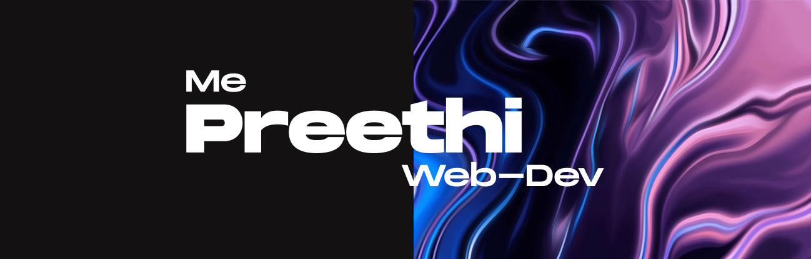
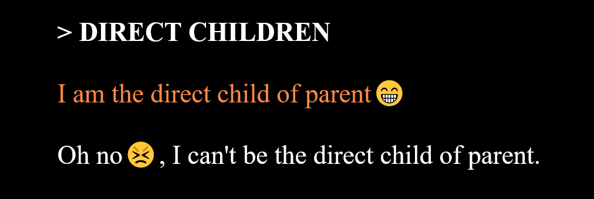
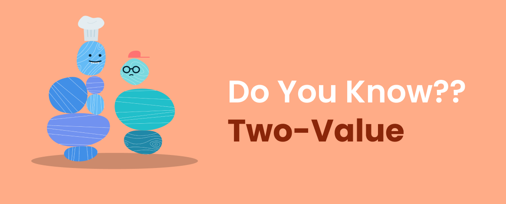

<h1 align="center">Hey There </h1> 

 
 
 
 

 
- 🔭 I’m currently working on **Modern layouts**
- 🌱 I’m currently learning **In-Depth Git underhoods**
- 🖊️ All the time, I’m writing **technical blogs**
- 💬 Ask me about **In-Depth CSS**
- 📫 I'm active on [Twitter](https://twitter.com/Preethi39195942)
- ⚡ Secret fact: I'm Coffee lover🍵

## Depth in Techs👩🏻‍💻

## Top Repositories

|  |  |
| :--: | :---: |

## Recently Started🖊️..

## My Popular Articles
| 12 Types of Advanced CSS Selectors!!   <a href="https://dev.to/preethi_dev/12-types-of-advanced-css-selectors-part-1-5b3d">**Read Now👉🏻**</a> |  |
| :-- | :---: |
| **A new Two-value syntax for display property🪄**  <a href="https://dev.to/preethi_dev/a-new-two-value-syntax-for-display-property-1p1e">**Read Now👉🏻**</a> |  |
| **For More articles👉🏻** |   |

  
<h2> How I won in my 1st Hackathon🏆</h2>

> Hey, you seems very curious...

<h3> <a href="https://dev.to/preethi_dev/cosmic-burden-behind-the-title-winning-of-my-1st-hackathon-51ab">See How I won 👉</a></h3>

|  |  |
| :---: | :---: |

## Oftentimes Languages

## ⚡Recent Activities
<!--START_SECTION:activity-->
1. ❗️ Opened issue [#192](https://github.com/Design-and-Code/support/issues/192) in [Design-and-Code/support](https://github.com/Design-and-Code/support)
2. 💪 Opened PR [#2](https://github.com/twin-engineers/PR-Practice/pull/2) in [twin-engineers/PR-Practice](https://github.com/twin-engineers/PR-Practice)
3. 💪 Opened PR [#1](https://github.com/twin-engineers/PR-Practice/pull/1) in [twin-engineers/PR-Practice](https://github.com/twin-engineers/PR-Practice)
<!--END_SECTION:activity-->

  Feel cheerful to connect with you on 👇🏻

   
   
  
  

<!--
**Preethi-Dev/Preethi-Dev** is a ✨ _special_ ✨ repository because its `README.md` (this file) appears on your GitHub profile.

Here are some ideas to get you started:

- 🔭 I’m currently working on ...
- 🌱 I’m currently learning ...
- 👯 I’m looking to collaborate on ...
- 🤔 I’m looking for help with ...
- 💬 Ask me about ...
- 📫 How to reach me: ...
- 😄 Pronouns: ...
- ⚡ Fun fact: ...
-->
