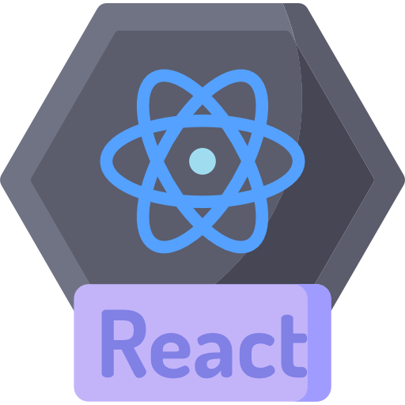
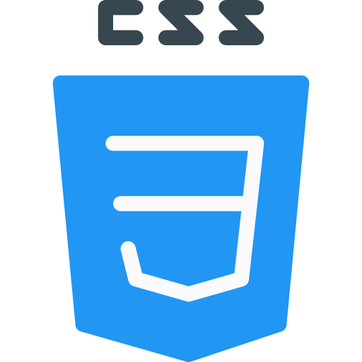

<h1 align="center">
  
  
  𝐇𝐞𝐥𝐥𝐨, 𝐟𝐞𝐥𝐥𝐨𝐰 <𝚍𝚎𝚟𝚎𝚕𝚘𝚙𝚎𝚛𝚜/>! 
</h1>

  <em>
    This is ME, Falguni Sarkar, a 3rd year undergraduate at <a href="http://sittechno.org/"> <b>Siliguri Institute of Technology</b>, Siliguri</a>.  
    A budding <b>Full-Stack Web Developer</b>  and a <b>Competitive Programming Enthusiast</b>&nbsp;&nbsp, who is <b>obsessed</b>
    with the idea of <b>improving</b> herself and wants a <b>platform</b> to 
    <b>grow</b> and 
    <b>excel</b> &nbsp.
  </em>

  
> &nbsp;***Talking about Personal Stuffs:***

-   🔭 I’m currently working on projects available at [devChallenges.io](https://devchallenges.io/) .
-   🌱 I’m currently learning stuff to be a Full-Stack Web Developer!
-   💬 AMA, I am happy to help!
-   📥 Drop your queries <a target="_blank" href="https://mailhide.io/e/uOjPBy2V">here</a>.
-   😄 Pronouns: [She/Her](https://pronoun.is/she)
-   ⚡ Fun fact: I like **Shinchan, sleeping, coding, listening to music, eating and blah blah blah**. I dislike everything except my likes!

  <i><b>GitHub Stats:octocat::</b></i>  
  
    
  

<i><b>Languages Currently Learning:</b></i> 
    
  &nbsp;
  &nbsp;
  &nbsp;
  &nbsp;
  &nbsp;
  &nbsp;
  &nbsp;

<i><b>Tools known:</b></i> 
    
  &nbsp;
  &nbsp;
  &nbsp;
  &nbsp;
  &nbsp;
  &nbsp;
  &nbsp;
  &nbsp;

  <i><b>Profiles:</b></i>  
  <a href="mailto:falgunisarkar526@gmail.com">
    &nbsp;
  </a>
  <a href="https://www.linkedin.com/in/falgunisarkar">
    &nbsp;
  </a>
  <a href="https://medium.com/@falgunisarkar">
    &nbsp;
  </a>
  <a href="https://isshefalguni.hashnode.dev/">
    &nbsp;
  </a>
  <a href="https://open.spotify.com/user/31glrpxgbfoi6qprbrezs4cwwaiu?si=74c6c3d9a8da4d5a">
    &nbsp;
  </a>
  <a href="https://discord.gg/5bCcEMEk8e">
    &nbsp;
  </a>
  <a href="https://twitter.com/isshefalguni">
    &nbsp;
  </a>
  <a href="https://www.instagram.com/isshefalguni">
    &nbsp;
  </a>
  <a href="https://dev.to/lostgirljourney">
    &nbsp;
  </a>

 
  <i><b>Currently Playing🎶...</b></i>
    
  
   
  

<!-- can't stop myself from editing🤷... -->
